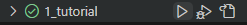

# 시작하기 

시작하기 앞서 서버에서 실행하시는 분들은 conda로 실습환경을 만들어주세요.  
로컬 사용자는 아래 코드는 필요하시면 진행하세요
```
(base) > conda create -name {사번}_unittest python=3.9
(base) > conda deactivate 
> conda activate {사번}_unittest
({사번}_unittest) > _ 
```


- 필요패키지를 설치해주세요 
```
> pip install -r requirement.txt 
```

- vscode 실행 뒤 왼쪽에 있는 플라스크 모양을 클릭하여 'Configure Python Tests' 를 클릭해 unittest를 선택해주세요. 
- test 범위 설정은 이 폴더내로 정해주시고 identify test files에서는 test_*.py 타입을 선택해주세요 

   
이 이미지가 보이면 성공입니다.   

  
RUN TEST를 클릭하여 잘 동작하는지 확인해 보시기 바랍니다. 


